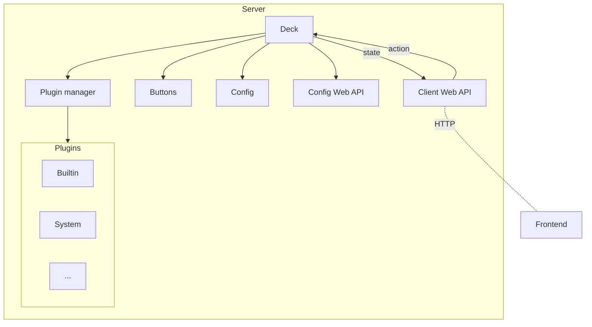

# Architecture in mermaid

```mermaid
flowchart TB


frontend[Frontend]

subgraph server_app [Server]
direction TB
  deck[Deck]
  plugin_manager[Plugin manager]
  buttons[Buttons]
  config[Config]
  web_api_s[Config Web API]
  web_api_c[Client Web API]
  subgraph plugins [Plugins]
  direction LR
    Builtin
    System
    ...
  end
end


deck --> config
deck --> plugin_manager
deck --> buttons

plugin_manager --> plugins
web_api_c -.- |HTTP| frontend

deck --> web_api_s

deck --> |state| web_api_c
web_api_c --> |action| deck
```

## Web API

There are two:
1. Client API (for deck buttons, clicks, etc.)
2. Server API (for editing config, buttons, backups, and other server settings)
